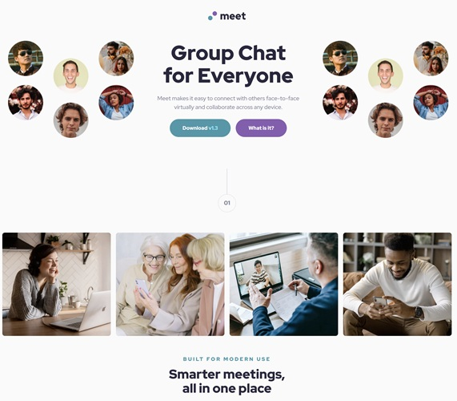

# Frontend Mentor - Meet landing page solution

This is a solution to the [Meet landing page challenge on Frontend Mentor](https://www.frontendmentor.io/challenges/meet-landing-page-rbTDS6OUR). Frontend Mentor challenges help you improve your coding skills by building realistic projects.

## Table of contents

- [Overview](#overview)
  - [The challenge](#the-challenge)
  - [Screenshot](#screenshot)
  - [Links](#links)
- [My process](#my-process)
  - [Built with](#built-with)
  - [What I learned](#what-i-learned)
  - [Continued development](#continued-development)

## Overview

### The challenge

Users should be able to:

- View the optimal layout depending on their device's screen size
- See hover states for interactive elements

### Screenshot




### Links

- Solution URL: [Repository URL](https://github.com/vCentDev/meet-landing-page)
- Live Site URL: [Live URL](https://meet-landing-page-vcentdev.netlify.app/)

## My process

### Built with

- Semantic HTML5 markup
- CSS custom properties
- Flexbox
- CSS Grid
- Mobile-first workflow
- BEM CSS

### What I learned

- In this challenge I learnt how to play with negative margins to achieve the hero image design and how to use the property `overflow: hidden` to control what should we see and hide.

- I have enhanced my CSS grid skills by utilizing it to arrange HTML elements for mobile, tablet, and desktop designs.

- Creating a professional responsive CSS design is crucial, as is adapting the font size based on the device being used. To achieve that, I used the clamp()function.

```css
font-size: clamp(0.8125rem, 0.769rem + 0.2174vw, 0.9375rem);
```

### Continued development

- To continue improving my CSS skills, I will focus on CSS grid features, as they are essential for achieving good layouts. I also want to improve my correct use of the BEM methodology and explore Cube CSS.
